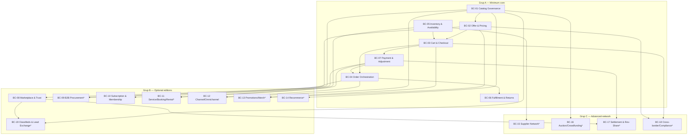

# Commerce Operating System — Bounded-Context Haritası

**Durum:** DRAFT — 2026-07-13 · **Kaynak yetki:** [`adr-0030-commerce-operating-system-boundary.md`](./adr-0030-commerce-operating-system-boundary.md) §2
**Kapsam:** Yalnız dokümantasyon; kod/şema/JSON üretmez, app/module düğümü açmaz ([`AGENTS.md`](../AGENTS.md) §0, §4.4).
**Taksonomi:** `module`/bounded-context = dağ. Hiçbir BC "app" diye anılmaz (ADR-0030 §2).

> **Bu harita bir öneri/karar taslağıdır, implementasyon kanıtı değildir.** BC seviyesine terfi, item-level triyaj + modül-terfi kriterleriyle doğrulanır ([`commerce-os-capability-classification.md`](./commerce-os-capability-classification.md) §4, §6). `(provisional)` işaretli BC'ler feature/policy/config'e çökebilir.

## 1. Değişmez kurallar

- **Cross-context write yok.** Bir BC yalnız kendi veri otoritesine yazar; başka BC'nin verisine yazamaz.
- **Döngü yok.** Bağımlılık yönü tek taraflıdır; senkron çağrı yerine domain event tercih edilir.
- **Business BC ≠ platform primitifi.** Tenancy/identity/PDP/entitlement/event-bus/audit/ledger/search/storage/extension **tüketilir, BC olarak yeniden yazılmaz** (§5, ADR-0030 §6).
- **Sağlayıcı sınırı.** Düzenlenmiş yürütme dış lisanslı sağlayıcıya delege edilir (ADR-0030 §7).

## 2. Grup A — Minimum core (satılabilir en küçük dilim)

**BC-01 · Catalog Governance** — Owner: Catalog ekibi · Data authority: ürün/variant/attribute/taksonomi/dijital-asset ref + governance/onay · Neden module: tek veri otoritesi + yaşam döngüsü + event.
- Lifecycle: draft → in-review → active → discontinued
- Publishes: `ProductPublished`, `ProductDiscontinued` · Consumes: — (kök otorite)
- Bağımlılık yönü: yukarı-akış (bağımsız) · Platform deps: search (indeks/projeksiyon), storage, tenancy
- Provider: — · Non-goals: fiyat/stok tutmaz, sunum/sıralama/keşif yapmaz

**BC-02 · Offer & Pricing** — Owner: Pricing ekibi · Data authority: teklif, fiyat listesi/kuralı, CPQ/sözleşme-fiyat · Neden module: bağımsız hesaplama zinciri + otorite.
- Lifecycle: offer/rule draft → active → expired
- Publishes: `PriceCalculated`, `OfferPublished` · Consumes: `ProductPublished` (CAT2)
- Bağımlılık yönü: Catalog → Offer&Pricing · Platform deps: tenancy, policy · Provider: vergi-hesaplama (dış, Compliance üzerinden)
- Non-goals: promosyon uygulamaz (Promotions), ödeme almaz

**BC-03 · Cart & Checkout** — Owner: Checkout ekibi · Data authority: aktif sepet, checkout oturumu, imzalı satın-alma niyeti · Neden module: bağımsız oturum durum makinesi.
- Lifecycle: cart open → checkout → placed/abandoned
- Publishes: `CartUpdated`, `OrderPlaced` · Consumes: `PriceCalculated` (Offer), `AvailabilityConfirmed` (Inventory), `DiscountApplied` (Promotions, ops.)
- Bağımlılık yönü: Offer/Inventory → Cart · Platform deps: tenancy, identity · Provider: ödeme başlatma (Payment üzerinden)
- Non-goals: ödeme yürütmez, sipariş/stok otoritesi tutmaz

**BC-04 · Order Orchestration** — Owner: Order ekibi · Data authority: sipariş, sipariş-kalemi, order durum makinesi · Neden module: merkez orchestrasyon + otorite.
- Lifecycle: created → paid → in-fulfillment → completed/cancelled
- Publishes: `OrderConfirmed`, `OrderCancelled` · Consumes: `OrderPlaced` (Cart), `PaymentCaptured` (Payment), `ShipmentDispatched` (Fulfillment)
- Bağımlılık yönü: Cart/Payment → Order; Order → Fulfillment/Inventory (event) · Platform deps: tenancy, event bus, audit · Provider: —
- Non-goals: ödeme orchestrasyonu, fiziksel fulfilment, stok otoritesi tutmaz

**BC-05 · Inventory & Availability** — Owner: Inventory ekibi · Data authority: stok seviyesi, rezervasyon, order-promise/ATP · Neden module: uygunluk otoritesi + rezervasyon lifecycle.
- Lifecycle: available → reserved → committed/released
- Publishes: `AvailabilityConfirmed`, `StockLevelChanged` · Consumes: `OrderConfirmed` (Order, commit)
- Bağımlılık yönü: Order → Inventory (commit); Inventory → Cart (availability, event) · Platform deps: tenancy, event bus · Provider: WMS/ERP (dış, ops.)
- Non-goals: satın-alma/replenishment yürütmez (Supplier), kargo yapmaz

**BC-06 · Fulfillment & Returns** — Owner: Fulfillment ekibi · Data authority: sevkiyat, fulfilment durumu, RMA/iade/ters-lojistik · Neden module: fulfilment+return lifecycle otoritesi.
- Lifecycle: allocated → dispatched → delivered → returned/closed
- Publishes: `ShipmentDispatched`, `ReturnAuthorized`, `RefundRequested` · Consumes: `OrderConfirmed` (Order)
- Bağımlılık yönü: Order → Fulfillment; refund → Payment (event) · Platform deps: audit, event bus · Provider: kargo/3PL/tamir (dış)
- Non-goals: ödeme refund'unu yürütmez (Payment), stok otoritesi tutmaz

**BC-07 · Payment & Adjustment Orchestration** — Owner: Payments ekibi · Data authority: ödeme niyeti, işlem durumu, refund, fee/adjustment · Neden module: sağlayıcı-agnostik orchestrasyon.
- Lifecycle: intent → authorized → captured → refunded/failed
- Publishes: `PaymentCaptured`, `PaymentRefunded`, `AdjustmentApplied` · Consumes: `OrderPlaced` (Cart), `RefundRequested` (Fulfillment)
- Bağımlılık yönü: Cart/Fulfillment → Payment; sonuç Order'a event · Platform deps: ledger, audit · Provider: **PSP/escrow/MoR (dış lisanslı, ADR-0030 §7)**
- Non-goals: lisanslı ödeme yürütmez (delege), uzlaştırma/gelir-paylaşımı yapmaz (Settlement)

## 3. Grup B — Optional editions

**BC-08 · Marketplace Operations & Trust** — Owner: Marketplace ekibi (MKT+TRS2) · Data authority: seller, komisyon kuralı, reputation, buyer-protection/vaka, sponsored-ranking · Neden module: çok-satıcılı otorite + trust lifecycle.
- Lifecycle: onboarding → active → suspended · Publishes: `SellerActivated`, `CommissionAccrued`, `TrustFlagRaised` · Consumes: `OrderConfirmed` (Order) · Bağımlılık: Order → Marketplace · Platform deps: identity, entitlement, ledger · Provider: KYC/AML (dış) · Non-goals: payout yürütmez (Settlement), fiyat hesaplamaz

**BC-09 · B2B Procurement & Account Commerce** `(provisional)` — Owner: B2B ekibi (B2B+PRC) · Data authority: hesap hiyerarşisi, sözleşme, requisition/RFx, PO/mal-kabul/fatura-eşleştirme · Neden module: bağımsız satış+alım lifecycle. **Provisional:** satış-tarafı mode profiline çökebilir.
- Publishes: `QuoteAccepted`, `PurchaseOrderApproved` · Consumes: `PriceCalculated` (Offer) · Bağımlılık: Offer/Catalog → B2B · Platform deps: identity, policy, entitlement · Provider: kredi/BNPL, tedarikçi-doğrulama (dış) · Non-goals: kendi fiyatını hesaplamaz

**BC-10 · Subscription & Membership** — Owner: Subscription ekibi (SUB+MEM2) · Data authority: plan, yenileme takvimi, üyelik/kademe, credit, consolidated/threshold billing · Neden module: dönemsel lifecycle + fatura otoritesi.
- Lifecycle: subscribed → renewed → paused → cancelled · Publishes: `SubscriptionRenewed`, `InvoiceIssued`, `CreditGranted` · Consumes: `PaymentCaptured` (Payment) · Bağımlılık: Payment → Subscription · Platform deps: ledger, tenancy · Provider: MoR/vergi (dış) · Non-goals: tek-seferlik siparişi yönetmez (Order)

**BC-11 · Service / Booking / Rental** `(provisional)` — Owner: Service ekibi (SRV+RNT+EVT2+IOT2) · Data authority: hizmet/randevu/iş-emri, kiralama sözleşmesi, koltuk/allotment/kapasite, asset-finance · Neden module: kapasite/süre lifecycle otoritesi. **Provisional:** lifecycle-otoriteye göre bölünür; EVT2 koltuk-envanteri ayrı BC olabilir.
- Publishes: `BookingConfirmed`, `RentalStarted`, `RentalReturned` · Consumes: `PaymentCaptured` (Payment), `AvailabilityConfirmed` (Inventory/kapasite) · Bağımlılık: Payment/Inventory → Service · Platform deps: tenancy, workflow · Provider: takvim/saha-servis/sigorta (dış) · Non-goals: fiziksel ürün fulfilment'ı yapmaz (Fulfillment)

**BC-12 · Channel / Omnichannel** — Owner: Channel ekibi (OMN+CHN2) · Data authority: kanal bağlantısı, feed/senkron durumu, dealer müşteri-SKU/blanket-order/rebate/sell-through · Neden module: dış-sistem senkron + kanal-ticaret sınırı.
- Lifecycle: connected → syncing → disconnected · Publishes: `ChannelSynced`, `RebateAccrued` · Consumes: `ProductPublished` (Catalog), `OrderConfirmed` (Order) · Bağımlılık: Catalog/Order → Channel · Platform deps: extension runtime, event bus · Provider: pazar-yeri/POS/dealer API (dış) · Non-goals: sipariş/stok otoritesi değil. **Not:** OMN (perakende) ↔ CHN2 (dealer/distributor/franchise) ayrı sub-context; birleşme insan kararına tabi.

**BC-13 · Promotions / Merchandising** `(provisional, opsiyonel — zorunlu core değil)` — Owner: Merch ekibi (PRM2+MER2) · Data authority: kampanya/kupon/indirim kuralı, vitrin/sıralama konfigürasyonu · Neden module: kural motoru + sunum. **Provisional:** Merchandising kısmı Catalog feature'ına çökebilir.
- Publishes: `DiscountApplied`, `CouponRedeemed` · Consumes: `PriceCalculated` (Offer), `CartUpdated` (Cart) · Bağımlılık: Offer/Cart → Promotions · Platform deps: policy, search · Provider: — · Non-goals: taban fiyat/ürün otoritesi tutmaz

**BC-14 · Recommerce & Asset Lifecycle** `(provisional)` — Owner: Recommerce ekibi (REC) · Data authority: tekil kullanılmış varlık, durum/koşul, provenans/otantisite, refurb/disposition · Neden module: tekil-varlık lifecycle (seri-üretim Catalog'dan farklı). **Provisional:** Aftermarket ile birleşebilir.
- Publishes: `AssetGraded`, `AssetListed` · Consumes: `ProductPublished` (Catalog, taksonomi) · Bağımlılık: Catalog → Recommerce · Platform deps: storage, audit · Provider: otantisite/refurb (dış) · Non-goals: seri-üretim katalog otoritesi tutmaz

**BC-19 · Classifieds & Lead Exchange** `(provisional, opsiyonel edition — bu doküman seti içinde append-only numara konvansiyonuyla eklendi; sıra-dışı numara kabul edilir, aşağıdaki nota bakınız)` — Owner: Classifieds/Lead ekibi (kaynak: [`s-classifieds.json`](../src/data/generated/nodes/s-classifieds.json)) · Data authority: ilan (listing), eşleştirme/lead kaydı, contact-unlock entitlement durumu, ilan moderasyon/spam durumu · Neden module: ilan+lead lifecycle otoritesi (transaction-öncesi eşleştirme; katalog/sipariş otoritesinden ayrı veri otoritesi). **Provisional:** Marketplace/Channel ile birleşebilir veya edition mode profiline çökebilir.
- Lifecycle: listing draft → published → matched/lead-captured → contact-unlocked → expired/closed
- Publishes: `ListingPublished`, `LeadCaptured`, `ContactUnlocked` · Consumes: `ProductPublished` (Catalog, taksonomi ops.), `SellerActivated` (Marketplace, ops.)
- Bağımlılık yönü: Catalog/Marketplace → Classifieds (tek yönlü; sipariş/ödeme otoritesine **yazmaz**) · Platform deps: search (ilan arama/keşif), identity/party, entitlement (contact-unlock), notification/messaging (lead teması), audit · Provider: — (ödeme/teslimat **platform-dışı**; contact-unlock ücretlendirmesi seçilirse Payment & Adjustment üzerinden orchestrate edilir, BC kendi ödemesini yürütmez) · Non-goals: ödeme/teslimat yürütmez (off-platform lead-gen modeli), katalog/sipariş/stok otoritesi tutmaz
- **Kaynak notu:** İnsan korpusunda classifieds/lead-gen **açık bir ticaret iş modelidir** (ilan/eşleştirme/contact-unlock ekonomisi). Kaynak düğümdeki "e-ticaret DEĞİLDİR" ifadesi yalnız *transaction'ın platform-dışı* olduğunu belirtir; Commerce OS kapsamı-dışı anlamına gelmez, bu yüzden UNRELATED değil provisional BC adayıdır.

> **Numara sırası notu (append-only konvansiyonu):** BC numaralandırması bu **yeni doküman seti içinde** benimsenen bir **append-only kimlik-kararlılığı / ileri-uyumluluk** konvansiyonudur; bu doküman kümesindeki BC-08…BC-18 kimlikleri kararlı kalsın diye Classifieds BC'si **BC-19** olarak eklenir ve Grup B'de sıra-dışı görünür. Bu bilinçlidir; amaç, halihazırda yayımlanmış dış referansları korumak değil, bu doküman setindeki BC kimliklerini (linkler, tablo satırları, çapraz-referanslar) yeniden dizilime karşı kararlı tutmaktır. Numaralar sıra-dışı olabilir; kimlik ≠ sıralama.

## 4. Grup C — Advanced-network

**BC-15 · Supplier Network** `(provisional)` — Owner: Supply ekibi (SUP2) · Data authority: tedarikçi, dropship bağlantısı, replenishment kuralı · Neden module: tedarik lifecycle. **Provisional:** PRC alım-akışı ile birleşebilir.
- Publishes: `PurchaseOrderRaised`, `ReplenishmentTriggered` · Consumes: `StockLevelChanged` (Inventory) · Bağımlılık: Inventory → Supplier · Platform deps: tenancy, event bus · Provider: ERP/tedarikçi API (dış) · Non-goals: müşteri siparişi/stok otoritesi tutmaz (Order/Inventory)

**BC-16 · Auction / Crowdfunding** `(provisional)` — Owner: Auction ekibi (AUC) · Data authority: açık artırma/kampanya, teklif, kapanış · Neden module: teklif-oluşum lifecycle. **Provisional:** MVP dışı.
- Publishes: `AuctionClosed`, `PledgeCommitted` · Consumes: `ProductPublished` (Catalog) · Bağımlılık: Catalog → Auction; kapanış → Cart (event) · Platform deps: event bus, tenancy · Provider: — · Non-goals: fiyat listesi tutmaz (Offer)

**BC-17 · Settlement & Revenue Share** `(provisional)` — Owner: Settlement ekibi · Data authority: uzlaştırma kaydı, payout partisi, gelir-paylaşımı/affiliate settlement · Neden module: finansal mutabakat lifecycle.
- Publishes: `PayoutSettled`, `ReconciliationClosed` · Consumes: `CommissionAccrued` (Marketplace), `PaymentCaptured` (Payment) · Bağımlılık: Marketplace/Payment → Settlement · Platform deps: ledger, audit · Provider: banka/payout (dış lisanslı, ADR-0030 §7) · Non-goals: ödeme almaz (Payment)

**BC-18 · Cross-border / Compliance** `(provisional)` — Owner: Compliance ekibi (XBR+CMP2) · Data authority: uyum/privacy/safety/sustainability kuralı, jurisdiction eşlemesi · **Provisional:** bağımsız lifecycle yoksa büyük ölçüde policy/profile (BC değil).
- Publishes: `ComplianceCheckPassed` · Consumes: `OrderPlaced` (Cart), `PriceCalculated` (Offer) · Bağımlılık: Cart/Offer → Compliance · Platform deps: policy (PDP), jurisdiction primitifi, audit · Provider: vergi-hesaplama/KYC/AML (dış) · Non-goals: vergiyi kendisi hesaplamaz (sağlayıcı)

## 5. Platform primitifleri (business BC DEĞİL — tüketilir)

Bunlar **BC değildir**; Commerce OS bunları yeniden yazmaz (ADR-0030 §6):
`Tenancy` (TEN) · `Identity/AuthZ/PDP` · `Party/Group/Acting-context` (DRC) · `Capability/Entitlement` (DRC capability-commerce; [`capability-entitlement-contract.md`](./capability-entitlement-contract.md)) · `Workflow/ECA/Mode` (DRC görsel-otomasyon; [`mode-profile-contract.md`](./mode-profile-contract.md)) · `Event bus` · `Audit` · `Ledger` · `Search & Discovery backing` (DAT2 analitik + DSC2 arama/keşif) · `Storage` · `Federated identity` (MAG) · `Platform/Extension runtime` (PLT2/EXT/AGT2, [`app-distribution-contract.md`](./app-distribution-contract.md) §3.4).

**Kanıtlanmamış/ertelenmiş paylaşılan-yetenek adayları (henüz onaylı platform primitifi DEĞİL):** `Atomik deneyim yayını/layout` (DRC) ve `Veri eşleme/import-export` (MAG) — **DEFER-HUMAN**. Bunlar primitif olarak **iddia edilmez**; sözleşme/impl-repo kanıtı gelene dek platform/shared-capability adayı olarak bekler ([`commerce-os-kernel-sdk-gap-directive.md`](./commerce-os-kernel-sdk-gap-directive.md) §3 satır 16, 23; §8). Import-export için mevcut migration/worker desenleri yeniden kullanılabilir ama **public tipli mapping port'u kanıtlanmamıştır**; atomik-yayın/layout **sözleşmesi kanıtlanmamıştır**.

**Feature/archetype/SDK yüzeyi (BC değil):** SEO Ops, kanal feed derleyici, offline POS edge, destek talebi, Q&A/bilgi, rozet, affiliate atıf, fit bilgisi, review zekası, editoryal graf, katalog projeksiyon/drift (MAG) ve arama/keşif (DSC2), agentic akışlar (AGT2), DRC/MAG **ad** aileleri — modül-terfi kriterini ([`commerce-os-capability-classification.md`](./commerce-os-capability-classification.md) §6) **geçmedikçe** BC üretmez; feature/archetype/workflow/SDK/platform yüzeyine eşlenir (classification §2.1–2.2).

## 6. Bağımlılık grafiği (Mermaid) — döngüsüz

Not: Oklar tek yönlü bağımlılık/senkron-olmayan event akışını gösterir; graf döngüsüzdür (senkron cross-context write yok). `Cart → Order` ve `Cart → Payment` kenarları **`OrderPlaced`** oluşumunu yansıtır (Cart imzalı satın-alma niyetini yayınlar; Order ve Payment bunu tüketir); `Payment → Order` ise `PaymentCaptured` geri-beslemesidir — üçü de aynı yöne akar, döngü oluşturmaz. Rezervasyon-commit (Order → Inventory) ve refund (Fulfillment → Payment) yalnız **event geri-beslemesidir**; senkron çağrı/döngü değildir, bu yüzden diyagramda çizilmez. `*` = provisional (feature/policy/config'e çökebilir).

## İlgili doküman

- [`adr-0030-commerce-operating-system-boundary.md`](./adr-0030-commerce-operating-system-boundary.md), [`commerce-os-product-scope.md`](./commerce-os-product-scope.md), [`commerce-os-capability-classification.md`](./commerce-os-capability-classification.md)
- [`capability-entitlement-contract.md`](./capability-entitlement-contract.md), [`mode-profile-contract.md`](./mode-profile-contract.md), [`app-distribution-contract.md`](./app-distribution-contract.md), [`task-to-code-contract.md`](./task-to-code-contract.md)
