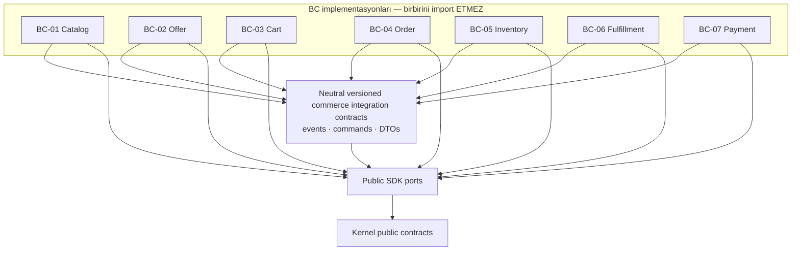

# Commerce Operating System — Bounded-Context Haritası

**Durum:** ACCEPTED — insan-onaylı **dokümantasyon sınırı** (design-time), 2026-07-13 · **Kaynak yetki:** [`ADR-0031`](./adr-0031-commerce-os-vibecoder-handoff-decisions.md) (D7/D10/D11) + [`ADR-0030`](./adr-0030-commerce-operating-system-boundary.md) §2 + [`Faz-5 entegrasyon kararı`](./enterprise-saas-phase-5-integration-decision.md).
**Bu bir implementasyon kanıtı DEĞİLDİR.** Harita, insan-kapatılmış kararların design-time sınırını kaydeder; runtime/GA hâlâ kanıt-kapılıdır ([`readiness oracles`](./commerce-os-vibecoder-readiness-oracles.md) O1). Hiçbir "runtime-ready / test-passed / GA" iddiası yoktur.
**Kapsam:** Yalnız dokümantasyon; kod/şema/JSON/queue/gate üretmez, app/module düğümü açmaz ([`AGENTS.md`](../AGENTS.md) §0, §4.4).
**Taksonomi:** `module`/bounded-context = dağ; hiçbir BC "app" diye anılmaz (ADR-0030 §2). DEMOTE edilenler **modül değildir** — feature/workflow/policy/integration/reporting/configuration yüzeyidir.

## 1. Değişmez kurallar (ADR-0031 safety invariants)

- **Cross-context write yok.** Bir BC yalnız kendi veri otoritesine yazar; başka BC'nin store'una yazamaz. Order komut gönderir; hedef BC kendi verisine yazıp **outcome event** döner.
- **Design-time döngü yok.** Bir BC implementasyonu **hiçbir başka BC implementasyonunu import etmez**; her iki taraf da **neutral versiyonlu commerce contract paketleri + public SDK port'ları** üzerine derlenir (D7). Design-time paket grafiği bir **DAG**'tır.
- **Runtime feedback ≠ design-time import.** Event'lerin "geriye" akması (ör. `PaymentCaptured` → Order) design-time bir import kenarı **yaratmaz**. **"Async olması tek başına döngü çözümü değildir"** (D7 rejected alternative).
- **Order tek yazardır.** Order state'inin tek yazarı BC-04'tür; Cart yalnız niyet yayınlar (D10).
- **Business BC ≠ platform primitifi.** Tenancy/identity/PDP/entitlement/event-bus/audit/ledger/search/geo/storage/billing/payment-execution/CRM/extension **tüketilir, BC olarak yeniden yazılmaz** (§4, ADR-0030 §6).
- **Sağlayıcı/regüle sınırı.** Düzenlenmiş yürütme (PSP/escrow/MoR/KYC/AML/vergi/payout) dış lisanslı sağlayıcıya delege edilir; sağlayıcı canonical business authority değildir (ADR-0030 §7).

## 2. Grup A — Minimum core (satılabilir en küçük dilim) — tam olarak BC-01..BC-07

Core yedi BC, D3 ile Commerce OS authority olarak kapalıdır. Aşağıdaki komut/outcome ve semantik, **implementasyon değil**, sözleşme sınırıdır.

**BC-01 · Catalog Governance** — Data authority: ürün/variant/attribute/taksonomi/dijital-asset ref + governance/onay.
- Lifecycle: draft → in-review → active → discontinued
- Publishes (outcome): `ProductPublished`, `ProductDiscontinued` · Consumes: — (kök otorite)
- Platform deps: search, storage, tenancy · Provider: — · Non-goals: fiyat/stok tutmaz, keşif/sıralama yapmaz

**BC-02 · Offer & Pricing** — Data authority: teklif, fiyat listesi/kuralı, CPQ/sözleşme-fiyat.
- Lifecycle: offer/rule draft → active → expired
- Publishes: `PriceCalculated`, `OfferPublished` · Consumes: `ProductPublished`
- Platform deps: tenancy, policy · Provider: vergi-hesaplama (dış) · Non-goals: promosyon uygulamaz, ödeme almaz

**BC-03 · Cart & Checkout** — Data authority: aktif sepet, checkout oturumu, imzalı satın-alma niyeti. **Sipariş YAZMAZ.**
- Lifecycle: cart open → checkout → **submitted**/abandoned
- Publishes: `CartUpdated`, **`CheckoutSubmitted`** (satın-alma *niyeti*; asla `OrderPlaced`/`OrderCreated` değil) · Consumes: `PriceCalculated`, `OfferPublished`, `AvailabilityConfirmed`
- Platform deps: tenancy, identity · Provider: — · Non-goals: sipariş/ödeme/stok otoritesi tutmaz, ödeme yürütmez

**BC-04 · Order Orchestration** — Data authority: sipariş, sipariş-kalemi, order state machine. **Order'ın tek yazarı + saga/process manager.**
- Lifecycle: created → confirmed → in-fulfillment → completed/cancelled
- Publishes: **`OrderCreated`**, **`OrderConfirmed`**, **`OrderCancelled`** · Consumes (outcome): `CheckoutSubmitted`, `StockReserved`/`ReservationReleased`/`ReservationExpired`, `PaymentAuthorized`/`PaymentCaptured`/`PaymentFailed`/`PaymentRefunded`, `ShipmentDispatched`/`ReturnAuthorized`
- Emits **command** (cross-context write DEĞİL): `ReserveStock`/`ReleaseReservation` → Inventory; `AuthorizePayment`/`CapturePayment`/`RefundPayment` → Payment; `StartFulfillment`/`CancelFulfillment` → Fulfillment
- Platform deps: tenancy, event bus, audit · Provider: — · Non-goals: stok/ödeme/fulfilment store'una yazmaz

**BC-05 · Inventory & Availability** — Data authority: stok seviyesi, rezervasyon (TTL sahibi), ATP/order-promise.
- Lifecycle: available → reserved → committed/released/expired
- Commands (consume): `ReserveStock`, `ReleaseReservation` · Outcomes (publish): `StockReserved`, `ReservationReleased`, **`ReservationExpired`**, `AvailabilityConfirmed`, `StockLevelChanged`
- **Rezervasyon-expiry:** TTL Inventory'nindir; süre dolunca `ReservationExpired` yayınlar. Platform deps: tenancy, event bus · Provider: WMS/ERP (dış) · Non-goals: replenishment/kargo yürütmez, order state'ine yazmaz

**BC-06 · Fulfillment & Returns** — Data authority: sevkiyat, fulfilment durumu, RMA/iade/ters-lojistik.
- Lifecycle: allocated → dispatched → delivered → returned/closed
- Commands (consume): `StartFulfillment`, `CancelFulfillment` · Outcomes (publish): `ShipmentDispatched`, `Delivered`, **`ReturnAuthorized`** (Order buna karşı Payment'a `RefundPayment` komutu verir)
- Platform deps: audit, event bus · Provider: kargo/3PL/tamir (dış) · Non-goals: **ödeme refund'unu yürütmez** (Payment), stok/order otoritesi tutmaz

**BC-07 · Payment & Adjustment Orchestration** — Data authority: ödeme niyeti, işlem durumu, refund, fee/adjustment.
- Lifecycle: intent → authorized → captured → refunded/failed
- Commands (consume): `AuthorizePayment`, `CapturePayment`, **`RefundPayment`** · Outcomes (publish): `PaymentAuthorized`, `PaymentCaptured`, `PaymentFailed`, `PaymentRefunded`, `AdjustmentApplied`
- **Refund yürütmesi Payment'ındır** (Order'ın refund-request komutu üzerine). Platform deps: ledger, audit · Provider: **PSP/escrow/MoR (dış lisanslı, ADR-0030 §7)** · Non-goals: lisanslı ödeme yürütmez (delege), uzlaştırma yapmaz

### 2.1 Saga / telafi / idempotency semantiği (D10 — implementasyondan önce şart)

- **Cancellation:** Order-initiated; telafi komutları (`ReleaseReservation`, `RefundPayment`, `CancelFulfillment`) verir; **`OrderCancelled`** yalnız telafiler ack'lendikten sonra yayınlanır. Örtük rollback yok; telafi her adım için **açık ve isimli**.
- **Rezervasyon-expiry / release:** Inventory TTL sahibi; expiry'de release-outcome yayınlar; Order geç rezervasyonu başarısız sayıp telafi eder.
- **Return / refund:** Fulfillment RMA/return sahibi; Payment refund *yürütmesi* sahibi (Order'ın komutu üzerine).
- **Duplicate / replay / out-of-order:** Tüm saga komutları **idempotent** (order + step id anahtarlı); consumer'lar message-id ile dedupe eder; sıra-dışı outcome order state machine'e uzlaşır, **terminal state'i asla üzerine yazmaz**.

## 3. Grup B — Opsiyonel adaylar (Faz-5 + D11 ile kesin uzlaşı)

**KEEP PROVISIONAL** = bağımsız-authority hipotezi; **modül terfisi değil**, sonraki-edition BC adayı. **DEMOTED** = mevcut core/platform authority'ye katlanan feature/workflow/policy/integration/reporting/configuration; **modül değildir**, alias/traceability için tarihsel BC-ID korunur.

### 3.1 KEEP PROVISIONAL (later-edition BC adayı; core gate'ten önce başlamaz)

| Aday | Tarihsel alias | Bağımsız-lifecycle hipotezi | Sınır |
|---|---|---|---|
| Marketplace Governance | BC-08 | seller onboarding/suspension/governance core order'dan ayrılabilir | CRM/identity/ledger tüketilir; payout yürütmez |
| Subscription & Membership | BC-10 | renewal/pause/cancel lifecycle bağımsız olabilir | billing execution/provider + entitlement platformdan tüketilir |
| Auction / Crowdfunding | BC-16 | bid/open/close/award lifecycle bağımsız olabilir | ödeme execution provider sınırı korunur; kapanış Cart niyetine bağlanır |
| Recommerce & Asset Lifecycle | BC-14 | serialized asset/provenance/condition/disposition bağımsız lifecycle | **first core slice DIŞINDA; core gate'ten önce implement edilemez** (D11) |

### 3.2 DEMOTED (module değil — feature/workflow/policy/integration/reporting/configuration)

| Aday | Tarihsel alias | Katlandığı yer | Sınıf |
|---|---|---|---|
| B2B Procurement/Account | BC-09 | core Catalog/Offer/Checkout | policy/configuration pack |
| Service/Booking/Rental | BC-11 | core Offer/Order/Fulfillment + workflow runtime | workflow/configuration pack |
| Channel/Omnichannel | BC-12 | platform headless surface + Commerce OS projeksiyon | integration/projection/config surface — D11 ile DEMOTED/CLOSED |
| Promotions/Merchandising | BC-13 | Offer & Pricing | pricing policy/feature |
| Classifieds / Lead Exchange | BC-19 | Catalog/Offer/CRM/Entitlement üzerinde opsiyonel edition | edition/workflow — **REOC Property/Listing'i sahiplenemez/kopyalayamaz** (D11) |
| Supplier Network | BC-15 | integration runtime + Inventory/Fulfillment | integration/configuration pack |
| Settlement & Revenue Share | BC-17 | Payment reconciliation/evidence; execution provider | reconciliation/reporting/integration surface |
| Cross-border / Compliance | BC-18 | platform policy/audit/jurisdiction + domain evidence | policy/configuration pack, counsel-gated |

## 4. Tüketilen platform yetenekleri (business BC DEĞİL — asla yeniden üretilmez)

Bunlar BC değildir; Commerce OS bunları tüketir (ADR-0030 §6):
`Tenancy` · `Identity/AuthZ/PDP` · `Party/Group/Acting-context` · `Capability/Entitlement` ([`capability-entitlement-contract.md`](./capability-entitlement-contract.md)) · `Workflow/ECA/Mode` ([`mode-profile-contract.md`](./mode-profile-contract.md)) · `Event bus` · `Audit` · `Ledger/Billing` · **`Payment execution`** (regüle, sağlayıcı) · `Search & Discovery` · **`Geo`** · `Storage` · `Federated identity` · **`CRM`** · `Platform/Extension runtime` ([`app-distribution-contract.md`](./app-distribution-contract.md) §3.4).

**DEFER-HUMAN paylaşılan-yetenek adayları (henüz onaylı primitif DEĞİL):** atomik-yayın/layout ve veri-eşleme/import-export — sözleşme/impl-repo kanıtı gelene dek platform/shared-capability adayı olarak bekler. Feature/archetype/SDK yüzeyleri (SEO Ops, feed derleyici, POS edge, Q&A, review zekası, agentic akışlar) modül-terfi kriterini ([`commerce-os-capability-classification.md`](./commerce-os-capability-classification.md) §6) geçmedikçe BC üretmez.

## 5. Design-time paket grafiği (DAG) — BC→BC import YOK

Her BC implementasyonu yalnız **neutral versiyonlu commerce contract paketleri** ve **public SDK port'ları** üzerine derlenir. Contract paketleri hiçbir business BC'ye bağımlı değildir (DAG kökü). Aşağıdaki graf **design-time paket import** yönüdür — runtime mesaj akışı değildir.

Not: Oklar **A, B'ye derleme-zamanı bağımlıdır** anlamındadır. `CIC`/`SDK`/`KER` yukarıdaki hiçbir düğüme bağlı değildir → graf döngüsüzdür. Consumer contract sürümünü pin'ler (major = breaking). Bir build BC→BC import eklerse **fail** eder.

## 6. Runtime mesaj akışları (AYRI tablo — design-time import kenarı DEĞİL)

Aşağıdaki akışlar §5'teki DAG'a **import kenarı eklemez**; hepsi contract paketleri üzerinden taşınır. "Geriye" akan outcome (ör. Payment→Order) yalnız event feedback'tir; **async olması tek başına döngü çözümü değildir** — çözüm komut/outcome ayrımı + tek-yazar Order semantiğidir.

| Üretici | Mesaj (tip) | Tüketici | Not |
|---|---|---|---|
| BC-01 Catalog | `ProductPublished` (event) | BC-02 Offer | katalog projeksiyonu |
| BC-02 Offer | `PriceCalculated`/`OfferPublished` (event) | BC-03 Cart | fiyat girdisi |
| BC-05 Inventory | `AvailabilityConfirmed` (event) | BC-03 Cart | gösterim/uygunluk |
| BC-03 Cart | `CheckoutSubmitted` (**intent**) | BC-04 Order | Order siparişi *oluşturur* |
| BC-04 Order | `ReserveStock`/`ReleaseReservation` (command) | BC-05 Inventory | Inventory kendi verisine yazar |
| BC-05 Inventory | `StockReserved`/`ReservationReleased`/`ReservationExpired` (outcome) | BC-04 Order | saga feedback |
| BC-04 Order | `AuthorizePayment`/`CapturePayment`/`RefundPayment` (command) | BC-07 Payment | Payment kendi verisine yazar |
| BC-07 Payment | `PaymentAuthorized`/`PaymentCaptured`/`PaymentFailed`/`PaymentRefunded` (outcome) | BC-04 Order | saga feedback |
| BC-04 Order | `StartFulfillment`/`CancelFulfillment` (command) | BC-06 Fulfillment | Fulfillment kendi verisine yazar |
| BC-06 Fulfillment | `ShipmentDispatched`/`Delivered`/`ReturnAuthorized` (outcome) | BC-04 Order | saga feedback |
| BC-04 Order | `OrderCreated`/`OrderConfirmed`/`OrderCancelled` (event) | ilgili tüketiciler | tek yazar |

Bu tablo, eski haritayı iki döngüye sokan **doğrudan `Cart→Order→Payment→Order` kenar dilini bilinçli olarak terk eder**: runtime feedback tek yönlü bir DAG kenarı olarak modellenmez.

## 7. Build dalgaları (runtime saga sırası değil; kanıt gelene dek opsiyonel adaylar bloklu)

1. **V0–V4:** clean worktree → kernel public contracts → SDK ports → commerce-os app-core → neutral commerce integration contracts.
2. **Wave A (paralel, ayrı dosya sahipliği):** Catalog + Offer + Inventory + Payment.
3. **Wave B–D (sıralı):** Cart (`CheckoutSubmitted`) → Order tek-yazar saga → Fulfillment.
4. **V12:** tüm core BC'leri neutral contracts üzerinden birleştiren dikey dilim.

Bu, **build/test sırasıdır**. Runtime saga akışı Order'ın Inventory/Payment/Fulfillment'a idempotent komut gönderip outcome tüketmesidir; build sırası runtime mesaj sırası olarak yorumlanmaz. Kanonik ayrıntı [`task packets`](./commerce-os-vibecoder-task-packets.md) V0–V12'dedir.

KEEP PROVISIONAL/DEMOTED adaylar **core dikey dilim kanıtı** ([`delivery sequence`](./kernel-sdk-app-delivery-sequence.md) §Commerce OS profili; O1 kapanışı) gelene kadar **bloklu**dur. Recommerce core gate'ten önce başlayamaz. Bu sıra design-time'dır; runtime/GA kanıtı ayrı, gelecek iştir.

## İlgili doküman

- [`ADR-0031 handoff decisions`](./adr-0031-commerce-os-vibecoder-handoff-decisions.md) · [`ADR-0030 boundary`](./adr-0030-commerce-operating-system-boundary.md)
- [`Faz-5 entegrasyon kararı`](./enterprise-saas-phase-5-integration-decision.md) · [`readiness oracles`](./commerce-os-vibecoder-readiness-oracles.md) · [`delivery sequence`](./kernel-sdk-app-delivery-sequence.md)
- [`capability-classification`](./commerce-os-capability-classification.md) · [`AGENTS.md`](../AGENTS.md)
