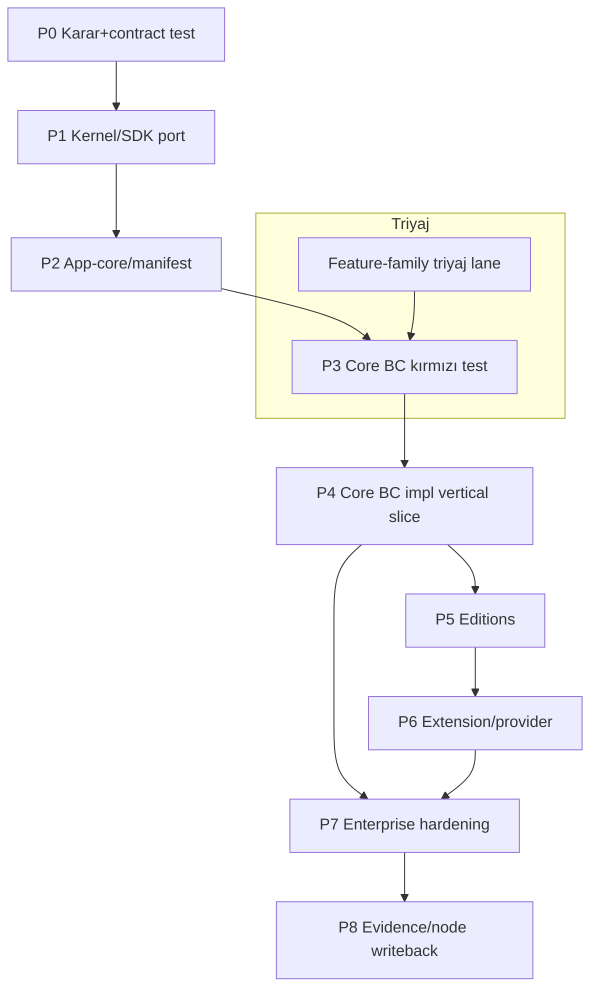

# Commerce Operating System — Test-Önce Paralel Handoff Planı

**Durum:** DRAFT — 2026-07-13 · **Kaynak yetki:** [`adr-0030-commerce-operating-system-boundary.md`](./adr-0030-commerce-operating-system-boundary.md), [`kernel-sdk-app-delivery-sequence.md`](./kernel-sdk-app-delivery-sequence.md), [`task-to-code-contract.md`](./task-to-code-contract.md)
**Kapsam:** Yalnız dokümantasyon/handoff. Bu plan **yalnız insan (human) geliştiriciler** içindir; ürün/platform implementasyon kodunu **yalnız insan geliştiriciler yazar** ([`AGENTS.md`](../AGENTS.md) §0, §4.4). AI ajanları bu iş akışında **kod yazmaz**; yalnız salt-okunur denetim (read-only audit) veya `actionplan` direktif/doküman incelemesi yapabilir. `actionplan` doc-maintainer ürün kodu yazmaz. Bu dosya kod/test/queue/node **üretmez**; hiçbir implementasyonun mevcut olduğunu **iddia etmez**.

> **Implementasyon iddiası YOKTUR.** Aşağıdaki fazlar bir **plan**dır, tamamlanmış iş değil. Kod `platform` monoreposundadır ([`AGENTS.md`](../AGENTS.md) §1); buradaki "platform yolu" örnekleri **illüstratiftir**, dosya varlığı kanıtı değildir ([`commerce-os-kernel-sdk-gap-directive.md`](./commerce-os-kernel-sdk-gap-directive.md) §7). Her faz **test-önce** zorunludur: önce kırmızı test, sonra yeşil implementasyon ([`AGENTS.md`](../AGENTS.md) §3).

## 1. Paralel çalışma modeli (lane / ownership / izolasyon)

- **Maks. güvenli paralel lane:** aynı anda **≤ 4 implementasyon lane + 1 entegrasyon lane**. Her lane bir **insan geliştirici / insan geliştirici ekibi**dir (AI implementasyon lane'i değildir). Fazlar arası bağımlılık DAG'ı (§4) bunu daraltabilir; bir fazın shard sayısı 4'ten azsa lane sayısı da azalır.
- **Ownership:** her shard'ın **tek yazarı** (insan geliştirici) vardır; iki geliştirici **aynı dosyaya veya aynı worktree'ye** yazmaz ([`AGENTS.md`](../AGENTS.md) §6).
- **İzolasyon:** her lane **ayrı worktree + ayrı branch**; paylaşılan tek nokta entegrasyon lane'idir (merge/DAG sırası).
- **Entegrasyon lane:** shard'ları birleştiren insan geliştirici; contract/regression kapılarını koşar; yeni iş mantığı yazmaz (sequence §App assembly).
- **PR shard sınırı:** her PR **≤ 400 net satır, ≤ 20 dosya**, tek-amaç + en az bir `non-goal` ([`AGENTS.md`](../AGENTS.md) §4.3). Aşan iş atomik PR'lara bölünür.
- **Araştırma ≠ backlog:** araştırma özellikleri (DRC/MAG item'ları, AGT2, provisional BC'ler) **anlık backlog değildir**; §2 triyajından geçmeden lane açılmaz.

## 2. Feature-family triyaj lane (implementasyondan ÖNCE — zorunlu kapı)

Herhangi bir implementasyon lane'i açılmadan, **triyaj lane** her aday item'ı sınıflandırır ([`commerce-os-capability-classification.md`](./commerce-os-capability-classification.md) §4 item-level triyaj):

1. Aidiyet (tek owner BC?) · 2. Seviye (feature/config/mevcut-parça? spekülatif BC yasak) · 3. Dedup · 4. Provenans (DRC/MAG runtime bağımlılık üretmiyor?) · 5. Provider sınırı · 6. Test-önce kapısı.

**DRC/MAG tekil item'ları, modül-terfi kriterini (classification §6) geçene dek `research` etiketiyle beklER; backlog'a girmez.** Triyaj çıktısı = disposition + hedef BC + seviye; kanıt olmadan "boşluk/feature" ilan edilmez.

## 3. Fazlar (P0–P8)

Her faz: **giriş · paralel lane/shard · izinli implementasyon dosya sınıfı (illüstratif) · zorunlu kırmızı test · çıktı/kanıt · stop-gate · non-goal · bağımlılık.** Platform yolları örnektir (`kernel-sdk-app-delivery-sequence.md` §Terimler).

### P0 — Karar & contract testleri
- **Giriş:** ADR-0030 slug/BC insan onayı ([`adr-0030…`](./adr-0030-commerce-operating-system-boundary.md) §Sonraki kapılar).
- **Lane/shard:** tek lane (contract iskeleti); paralel değil.
- **Dosya sınıfı:** `apps/api/tests/contract/*` (kırmızı sözleşme testleri), contract fixtures.
- **Kırmızı test:** her core BC için imza/şema yokken kırmızı contract testi (gap §6).
- **Çıktı/kanıt:** kırmızı test paketi + karar kayıt izi.
- **Stop-gate:** ADR-0030 onayı yoksa DUR.
- **Non-goal:** iş mantığı yazmak. **Bağımlılık:** —.

### P1 — Kernel/SDK önkoşul portları
- **Giriş:** P0 yeşil; SDK readiness çıkış eşiği hedefi ([`be-sdk-readiness-gap-2026-07-09.md`](./be-sdk-readiness-gap-2026-07-09.md)).
- **Lane/shard (≤4):** tenant/context · PDP/policy · audit+outbox/event · capability/entitlement + workflow/state + provider-port + search + storage + ledger (sequence §Zorunlu SDK portları).
- **Dosya sınıfı:** `packages/sdk/*`, `apps/api/platform_*` public port.
- **Kırmızı test:** typed-port imzası yokken kırmızı; multi-tenant izolasyon + forbidden-stack tarama.
- **Çıktı/kanıt:** deterministic codegen, typed port testleri, forbidden-stack raporu (sequence §Kanıt).
- **Stop-gate:** kernel `check-core-contract` kırmızı veya SDK hedef yolu yoksa DUR (sequence §No-Go).
- **Non-goal:** yeni kernel primitifi icat etmek (gap §3 uyarısı). **Bağımlılık:** P0.

### P2 — App-core / manifest
- **Giriş:** P1 SDK portları hazır; ADR-0030 onayı.
- **Lane/shard:** tek lane (app-core tekildir).
- **Dosya sınıfı:** `apps/api/platform_commerce_os_core`, `apps/web/src/apps/commerce-operating-system` kabuğu.
- **Kırmızı test:** app slug/capability/event-namespace + app-core healthz kırmızı-önce (sequence Kapı 2).
- **Çıktı/kanıt:** BC listesi, edition/mode kompozisyon kuralı, app-level policy varsayılanı, app manifest taslağı ([`commerce-os-stack-app-composition.md`](./commerce-os-stack-app-composition.md) §1).
- **Stop-gate:** app-core tanımlanmadan hiçbir BC module development'a geçmez (sequence §2).
- **Non-goal:** iş mantığı / BC domain kodu. **Bağımlılık:** P1.

### P3 — Core BC contract/model kırmızı testleri
- **Giriş:** P2 app-core hazır.
- **Lane/shard (≤4, bağımsız):** BC-01 Catalog · BC-02 Offer&Pricing · BC-05 Inventory · BC-07 Payment (birbirinden bağımsız veri otoriteleri); BC-03/04/06 P4'e event-bağımlı.
- **Dosya sınıfı:** `apps/api/platform_commerce_os_<bc>/tests/*`, model şeması stub.
- **Kırmızı test:** domain event/model yokken kırmızı contract + model testleri.
- **Çıktı/kanıt:** her BC için kırmızı contract seti + tenant-izolasyon negatif case'leri.
- **Stop-gate:** test-plan kapısı geçilmeden model implementasyonu yok ([`task-to-code-contract.md`](./task-to-code-contract.md) §2–3).
- **Non-goal:** yeşil implementasyon (P4'e ait). **Bağımlılık:** P2.

### P4 — Core BC implementasyonu (vertical slice)
- **Giriş:** P3 kırmızı testler mevcut; DAG sırası (BC-map §6).
- **Lane/shard (paralellik yalnız bağımlılığın izin verdiği yerde):** BC-map §6 grafiği gerçek bağımlılıkları belirler; sahte bağımsız çift **yok**. Güvenli sıra/lane planı:
  - **Lane A — Catalog→Offer** (kök otorite → fiyat; bağımsız başlar).
  - **Lane B — Inventory** (uygunluk otoritesi; Catalog/Offer'dan bağımsız, A ile paralel).
  - **Lane C — Cart** (Offer **ve** Inventory yeşil olduktan sonra; `PriceCalculated`+`AvailabilityConfirmed` tüketir).
  - **Entegrasyon sırası — Payment + Order (koordineli), Cart'tan sonra:** Order **yalnızca Payment'tan sonra oluşturulmaz.** Doğru akış: Cart `OrderPlaced` yayınlar → **Order lane** bu `OrderPlaced`'tan **pending/ödeme-bekliyor** durumunda Order'ı oluşturur; **Payment lane** aynı `OrderPlaced`'tan ödeme niyeti (payment intent) oluşturur; `PaymentCaptured` mevcut Order'ı durum geçişine uğratır; ardından `OrderConfirmed` Fulfillment'ı açar. Payment ile Order **bağımsız paralel lane değildir**; ortak `OrderPlaced`/`PaymentCaptured`/`OrderConfirmed` event sözleşmeleri **dondurulduktan sonra** ve **dosya çakışması olmadan** ayrı insan yazarlar kullanılabilir. Sözleşme/entegrasyon testlerinin sahibi **entegrasyon lane'idir**.
  - **Fulfillment — Order `OrderConfirmed` verdikten sonra** (`OrderConfirmed` tüketir; Payment'a değil Order'a bağımlıdır).
  - Aynı BC iki lane'de yazılmaz; `(Cart→Order)` ve `(Payment→Fulfillment)` **bağımsız paralel değildir** (eski eşleme kaldırıldı).
- **Dosya sınıfı:** `platform_commerce_os_<bc>/{models,api,services}`, `apps/web/.../<bc>` projection.
- **Kırmızı test:** her feature önce kırmızı; §5 adversarial eksenleri zorunlu.
- **Çıktı/kanıt:** kırmızı→yeşil geçiş, AC testleri, `AppModule` registry testi, audit/outbox izi.
- **Stop-gate:** cross-context write denemesi → DUR (BC-map §1); provider yürütme app içine gömülürse DUR (ADR-0030 §7).
- **Non-goal:** opsiyonel edition BC'leri; storefront UI (scope §4). **Bağımlılık:** P3, DAG.

### P5 — Editions
- **Giriş:** P4 core 7 BC yeşil.
- **Lane/shard (≤4):** Core · Marketplace · Subscription · Enterprise-B2B/Advanced-Network edition paketleri.
- **Dosya sınıfı:** edition manifest + capability/entitlement gate config (composition §4).
- **Kırmızı test:** edition capability gate + "tenant her şeyi almaz" negatif testi; mode/edition primitif bypass etmez.
- **Çıktı/kanıt:** required/optional module listesi, capability gate testi.
- **Stop-gate:** core 7 BC yeşil değilken edition paketleme (sequence §No-go). **Non-goal:** yeni BC iş mantığı. **Bağımlılık:** P4.

### P6 — Extension / provider ekosistemi
- **Giriş:** P5 + provider port sınıfı insan kararı (gap §8-Q2).
- **Lane/shard (≤4):** PSP/vergi provider port · kanal/marketplace extension · out-of-process health · import-export/mapping.
- **Dosya sınıfı:** `k-provider-adapter` port sınıfı, extension runtime adaptörü.
- **Kırmızı test:** provider-failure/circuit-breaker, extension sandbox/permission, egress deny (§5).
- **Çıktı/kanıt:** provider port testleri, sandbox exfiltration testi ([`marketplace-module-security-directive.md`](./marketplace-module-security-directive.md)).
- **Stop-gate:** ödeme/vergi port sınıfı için §8-Q2 insan kararı yoksa DUR. **Non-goal:** lisanslı yürütme (provider'da kalır). **Bağımlılık:** P5.

### P7 — Cross-model / enterprise sertleştirme
- **Giriş:** P4–P6 yeşil.
- **Lane/shard (≤4):** security/performance · a11y · reliability/DLQ · observability (mevcut enterprise wave kapıları, [`wave3-enterprise-readiness-gap-2026-07-09.md`](./wave3-enterprise-readiness-gap-2026-07-09.md)).
- **Dosya sınıfı:** CI gate config, load/axe/chaos test paketleri.
- **Kırmızı test:** §5 tam adversarial matris + composite mode senaryoları.
- **Çıktı/kanıt:** enterprise DoD matrisi ([`enterprise-dod.md`](./enterprise-dod.md)).
- **Stop-gate:** herhangi bir enterprise kapı kırmızıysa release yok. **Non-goal:** yeni feature. **Bağımlılık:** P4–P6.

### P8 — Evidence / node writeback (yetkili insan workflow'u)
- **Giriş:** P0–P7 kanıtları hazır; insan onayı.
- **Lane/shard:** tek lane (izole node writeback).
- **Dosya sınıfı:** `src/data/generated/nodes/*.json` — **yalnız yetkili insan workflow'u** ([`AGENTS.md`](../AGENTS.md) §4.4; AI app/module üretemez), izole tek-shard.
- **Kırmızı test:** content/data-quality kapıları (`check-content`, `check-data-quality`).
- **Çıktı/kanıt:** evidence patch + kapı çıktıları ([`evidence-update-runbook.md`](./evidence-update-runbook.md)).
- **Stop-gate:** kanıtsız "yapıldı" writeback → DUR; AI doğrudan app/module düğümü açamaz. **Non-goal:** kanıt olmadan node oluşturma. **Bağımlılık:** P7.

## 4. Bağımlılık DAG'ı (Mermaid)



## 5. Adversarial test matrisi (her ilgili fazda kırmızı-önce)

| Eksen | Beklenti |
|---|---|
| Tenant izolasyonu | Cross-tenant okuma/yazma reddi ≥10 negatif; fail-closed |
| Authz / PDP | Deny-by-default; yetkisiz eylem reddi |
| Idempotency / replay | Çift-tetik → tek etki; etiketli `scaled_write` |
| Cross-context ownership | Başka BC verisine yazma denemesi reddi |
| Provider failure | Fallback/circuit-breaker; port hatası sızmaz |
| Money rounding | Para yuvarlama/kesinlik; kayıpsız toplam |
| Inventory race | Eşzamanlı rezervasyon; oversell yok |
| Double capture/refund | Çift capture/refund reddi; idempotent |
| Event versioning | Şema evrimi + geriye-uyum; ordering (aggregate_version) |
| Extension sandbox/permission | Ağ/dosya/process default-deny; egress deny |
| Offline sync conflict | Çakışma çözümü; deterministik merge |
| Agentic mandate denial | İmzasız/yetkisiz mandat reddi ([`AGENTS.md`](../AGENTS.md) §4.4) |
| A11y | axe/keyboard/focus/contrast (WCAG 2.2) |

Kaynak: [`commerce-os-kernel-sdk-gap-directive.md`](./commerce-os-kernel-sdk-gap-directive.md) §6, [`kernel-execution-contract-matrix.md`](./kernel-execution-contract-matrix.md) §9, §12, [`event-replay-projection-contract.md`](./event-replay-projection-contract.md).

## 6. Faz-tamamlanma özeti şablonu (kısa)

```
Faz: P<n> — <ad>
Giriş kapısı: <yeşil mi? kanıt linki>
Shard'lar (lane/owner/branch): <liste; iki yazar aynı dosyada YOK>
Kırmızı-önce test: <link> · Yeşil geçiş: <link>
Adversarial eksenler (§5): <geçen/eksik>
PR shard'ları: <≤400 net satır, ≤20 dosya? evet/hayır>
Kanıt/evidence: <audit/outbox/CI URL>
Stop-gate ihlali: <yok / açıklama>
Non-goal doğrulaması: <bildirilen non-goal>
Sonraki faz bağımlılığı (DAG §4): <hazır mı?>
```

## İlgili doküman

- [`commerce-os-stack-app-composition.md`](./commerce-os-stack-app-composition.md), [`adr-0030-commerce-operating-system-boundary.md`](./adr-0030-commerce-operating-system-boundary.md), [`commerce-os-product-scope.md`](./commerce-os-product-scope.md), [`commerce-os-bounded-context-map.md`](./commerce-os-bounded-context-map.md), [`commerce-os-capability-classification.md`](./commerce-os-capability-classification.md), [`commerce-os-kernel-sdk-gap-directive.md`](./commerce-os-kernel-sdk-gap-directive.md)
- [`kernel-sdk-app-delivery-sequence.md`](./kernel-sdk-app-delivery-sequence.md), [`task-to-code-contract.md`](./task-to-code-contract.md), [`ready-for-dev-gate.md`](./ready-for-dev-gate.md), [`kernel-execution-contract-matrix.md`](./kernel-execution-contract-matrix.md), [`enterprise-dod.md`](./enterprise-dod.md)