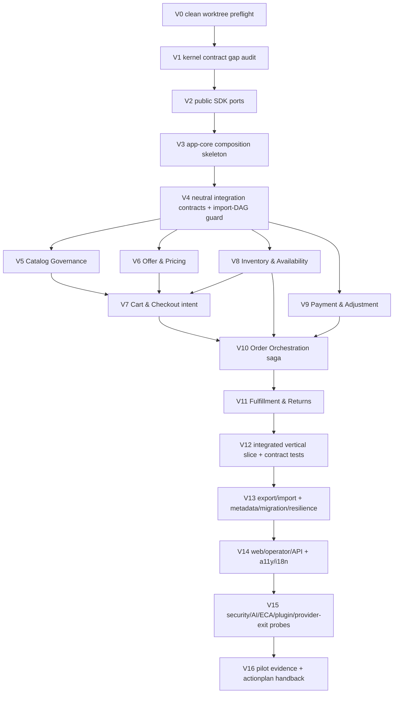

# Commerce Operating System — Master Human Developer Test-First Handoff

> **AUTHORITY-LOCK:** `Codex → PM → uzman ajanlar → Claude workers/slaves`.
> Codex nihai karar merciidir; PM ardıl koordinasyon yetkilisidir. AI erişimi
> `read-only-audit`, platform yürütücüsü `human-developer-only`dır. Dosya adı içindeki
> `vibecoder` yalnız tarihsel ref uyumluluğu için korunur.

**Status:** HUMAN-DEVELOPER HANDOFF — 2026-07-13. **Explicitly NOT runtime-ready and NOT GA-ready.** No working slice, green test, or SLO/COGS/backup-restore/AI-safety proof is claimed here — those remain future, evidence-gated work ([`readiness-oracles`](./commerce-os-vibecoder-readiness-oracles.md) O1/O10).
**Authority contract:** Codex scope, priority, rollback and final verification authority; PM coordinates packet order and evidence; specialist/Claude outputs are read-only recommendations. Only the human developer may create an implementation worktree/branch, write code/tests, commit, or open a PR. This document itself writes no code/schema/JSON/queue/node/gate and opens no app/module node ([`AGENTS.md`](../AGENTS.md) §0, §4.4).
**Scope:** Documentation/handoff only. Platform code lives in the `platform` monorepo; the paths below are **proposed but explicit** target paths for the implementation repo, not evidence any file exists.

> **instruction-ready ≠ runtime-ready.** Reading this handoff, a new implementer can select and start the first packet with **no architecture or product decision left to make**, knowing exactly which repo, which recorded base commit, and which test-first stop-gate apply. That is the *only* claim; runtime proof is separate, future work. This supersedes the earlier human-only DRAFT plan and its Cart-`OrderPlaced` / direct `Cart→Order→Payment→Order` language (now replaced by the D10/D7 model in §0.3).

## 0.1 Readiness precondition (why the status may be asserted)

HUMAN-DEVELOPER HANDOFF status is asserted **only because** the twelve readiness oracles O1–O12 have a defined GREEN path and the packet catalog satisfies the 14-field completeness rule ([`readiness-oracles`](./commerce-os-vibecoder-readiness-oracles.md) §2, O5). If any oracle is RED (D7 publication blocker open, a dependency cycle, a missing packet field, a fabricated "done/GA/passed" claim), this status **reverts to BLOCKED** and no packet is "ready" (oracles §6). The status is about handoff clarity, not execution.

## 0.2 Source authority set (canonical — referenced, not restated)

- [`ADR-0031`](./adr-0031-commerce-os-vibecoder-handoff-decisions.md) — D7–D13 (DAG, `CheckoutSubmitted`, single-writer Order, split data authorities, editions demotion, AI human-gate, pilot envelope).
- [`bounded-context map`](./commerce-os-bounded-context-map.md) — BC-01…BC-07 core, design-time DAG (§5), runtime message table (§6), order (§7).
- [`readiness-oracles`](./commerce-os-vibecoder-readiness-oracles.md) — O1–O12 + 14-field skeleton. [`contract-test plan`](./commerce-os-contract-test-plan.md) — RED families F1–F16.
- [`data-migration contract`](./commerce-os-data-migration-contract.md) — D8/D9 RACI, envelope↔payload boundary, expand→migrate→contract.
- [`implementation-workspace-manifest`](./implementation-workspace-manifest.md) — roots `apps/api`, `apps/web`, `packages/sdk`, `infra`. [`kernel-sdk-app-delivery-sequence`](./kernel-sdk-app-delivery-sequence.md) — Kernel→SDK→app-core gate, `check-core-contract`, `commerce-operating-system` slug.
- **Task packet catalog:** [`commerce-os-vibecoder-task-packets.md`](./commerce-os-vibecoder-task-packets.md) — packets **V0…V16**, all 14 oracle fields each.

## 0.3 Global invariants (never violate)

Source: ADR-0031 §Safety invariants; BC-map §1.
1. **No BC→BC import.** A BC compiles only against **neutral versioned commerce integration-contract packages + public SDK ports**; the design-time package graph is a **DAG**; a build adding an `import order from cart`-style edge **fails**. "It's async" is not a cycle solution.
2. **No cross-context write.** A BC writes only its own authority; Order sends **commands**, the target BC writes itself and returns an **outcome event**.
3. **Cart emits intent only.** BC-03 publishes **`CheckoutSubmitted`** (purchase intent) — never `OrderPlaced`/`OrderCreated`, never writes an order.
4. **Order is the single writer + saga.** BC-04 alone creates/writes the order and runs the saga; all saga commands idempotent (order+step id); terminal states never overwritten by late/out-of-order outcomes.
5. **Provider/regulated boundary.** Licensed execution (PSP/escrow/MoR/KYC/AML/tax/payout) stays behind an external provider port; provider is not the canonical authority (ADR-0030 §7).
6. **Optional editions BLOCKED.** No Group B/C candidate (Marketplace/Subscription/Auction/Recommerce/Classifieds/…) is scaffolded before the core slice (BC-01…BC-07) is proven; Recommerce cannot start before the core gate (D11).
7. **AI high-risk actions human-gated** (D12); only abstain/degrade/kill-switch may auto-fire. Crypto-shred needs governance/counsel authorization; key loss is fail-closed (D9).

## 1. Roles, ownership, and parallelism (no concurrency claim)

- **Codex MASTER / architecture authority** owns scope, priority, rollback and final review. PM coordinates the approved sequence; AI actors only audit and propose; the human developer executes.
- **Single writer per path.** Every allowed-files pattern has exactly one owning packet/lane at a time; two writers never touch the same file, directory, or worktree ([`AGENTS.md`](../AGENTS.md) §6).
- **Isolation.** Each lane = its own worktree + own branch. The only shared point is the integration lane (merge/DAG order).
- **Max 4 parallel independent lanes**, and **only** where the phase DAG (§3) *and* disjoint file ownership both permit. This is an upper bound on *safe* concurrency, **not** a claim that four lanes are actually running.
- **Per-packet budget:** ≤ 400 net lines, ≤ 20 files, single purpose, ≥ 1 non-goal, **separate PR per packet or smaller** ([`AGENTS.md`](../AGENTS.md) §4.3). Overflow ⇒ split into atomic PRs.
- **Test-first mandatory:** every packet starts with a RED test (fail-closed observed) before green implementation ([`task-to-code-contract`](./task-to-code-contract.md) §2–3).
- **Waterfall packet içi kapı:** V5–V11 gibi veri taşıyan her paket `requirements → test-plan (RED) → db-schema/migration contract → development → test-qa` alt-sırasını izler. Migration/model kararı gereken işte test-plan ve geri-alınabilir schema/migration alt-PR'ı geçmeden production handler/service yazılmaz; tek paket bütçeyi aşarsa bu alt-fazlar ayrı, sıralı child PR'lara bölünür.

## 2. V0 — Clean sibling worktree preflight (mandatory first action)

The platform repo was verified **DIRTY** with the user's uncommitted changes; the dirty tree **must never be a write target**.
- **Record an explicit base commit first** (the reviewer-confirmed clean HEAD, e.g. `930c09b4041fe91b5682806eb391b70745c007cd`) into packet evidence. No packet starts from an unrecorded base.
- **Create a clean sibling worktree** from that commit, on a fresh branch, in a sibling directory to the dirty checkout.
- **Never `stash`, `reset`, `clean`, `checkout -f`, or copy the dirty tree.** The user's changes are out of scope — neither consumed nor discarded. If the recorded base is not clean/reachable, V0 **STOPS** and returns to Codex.
- V0 writes **no files**; read-only preflight only (see packet V0).

## 3. Phase DAG and safe parallel waves

Sequence (BC-map §7; delivery-sequence gates): **Kernel → SDK → app-core → neutral integration contracts → core module lanes → integration → web/ops → evidence.**

**Safe parallel waves (upper bound = 4 lanes, disjoint dirs only):**
- **Wave A (after V4):** V5 / V6 / V8 / V9 in parallel — four **disjoint** BC subdirectories, each depending only on V4 contracts, never on each other.
- **Wave B:** V7 (Cart) only after V5 + V6 + V8 **contracts** are frozen (`PriceCalculated`/`OfferPublished`/`AvailabilityConfirmed` as intent inputs).
- **Wave C:** V10 (Order saga) only after V7 + V8 + V9 contracts (`CheckoutSubmitted` intent + reserve/payment command-outcome contracts).
- **Wave D:** V11 (Fulfillment) only after V10 contract.
- **Integration last:** V12 after V11; V13→V16 strictly sequential. No wave licenses a BC→BC import — all cross-BC edges go through V4 contract packages.

## 4. Packet selection rules

1. Pick the lowest-numbered packet whose **prerequisites** are all GREEN and whose **allowed-files** are unowned by any in-flight lane.
2. Within Wave A, pick any of V5/V6/V8/V9 whose directory you can own exclusively; never exceed 4 concurrent lanes.
3. Never open an optional-edition packet — none exist in V0…V16 by design (§0.3.6).
4. Never open a packet whose canonical RED family (F1–F16) is undefined for its slice.
5. A packet that cannot fit ≤400 net lines / ≤20 files must be split before starting.

## 5. Evidence writeback

- Each packet produces evidence **in the implementation repo** (RED→GREEN artifacts, audit/outbox trace, envelope refs for V13/V15). Evidence schema: [`contract-test plan`](./commerce-os-contract-test-plan.md) §5; `greenArtifact` must be **actual**, never a plan.
- **Node/app/module writeback stays human-authorized.** V16 may *propose* an `actionplan` evidence writeback but must not directly change `actionplan` app/module nodes unless separately human-authorized ([`AGENTS.md`](../AGENTS.md) §4.4).
- AI actors never create worktrees/branches, write product code/tests, commit, push, merge, open PRs, or perform destructive git operations.

## 6. No-go / stop conditions (any one ⇒ STOP, return to Codex)

- V0 base commit missing/unrecorded/dirty/unreachable, or any instruction implies using/stashing/resetting the dirty tree.
- Any oracle O1–O12 RED (esp. D7 publication blocker) ([`readiness-oracles`](./commerce-os-vibecoder-readiness-oracles.md) §6).
- A packet would introduce a BC→BC import, a second writer of order state, a cross-context write, or embedded regulated execution.
- A packet lacks any of the 14 fields or a non-goal, or exceeds budget without splitting.
- Kernel `check-core-contract` RED, or SDK target path absent while V2 has not created it (delivery-sequence §No-Go).
- An optional-edition BC requested before the core slice (V5…V12) is proven.
- A test command presented as existing when it is only `expected-after-scaffold`.
- Any runtime/GA/"tests passed" claim without actual evidence (O10).

## 7. Reference: legacy human-only lane model (superseded)

- **Feature-family triage gate** stays mandatory before any implementation lane: research features (DRC/MAG items, provisional BCs) are **not** instant backlog and get no lane until item-level triage classifies them ([`commerce-os-capability-classification.md`](./commerce-os-capability-classification.md) §4/§6).
- **Adversarial test matrix** (tenant isolation, authz/PDP, idempotency/replay, cross-context ownership, provider failure, money rounding, inventory race, double capture/refund, event versioning, plugin sandbox, offline-sync, agentic mandate, a11y) is required red-first per relevant packet; canonical families are F1–F16 in [`contract-test plan`](./commerce-os-contract-test-plan.md).
- The older P0–P8 phase names map onto V0–V16; where any legacy note implied Cart emitting `OrderPlaced` or a direct `Cart→Order→Payment→Order` edge, the §0.3 D10/D7 model (Cart `CheckoutSubmitted` intent + single-writer Order saga + neutral contracts) governs.
- **Ownership:** her shard'ın **tek yazarı insan geliştiricidir**; iki writer **aynı dosyaya veya aynı worktree'ye** yazmaz ([`AGENTS.md`](../AGENTS.md) §6). Codex MASTER her changeset'i bağımsız doğrular.
- **İzolasyon:** her lane **ayrı worktree + ayrı branch**; paylaşılan tek nokta entegrasyon lane'idir (merge/DAG sırası).
- **Entegrasyon lane:** shard'ları birleştiren tek yetkili writer; contract/regression kapılarını koşar, yeni iş mantığı yazmaz (sequence §App assembly). Birleştirme/commit/push ayrıca insan onayı ister.
- **PR shard sınırı:** her PR **≤ 400 net satır, ≤ 20 dosya**, tek-amaç + en az bir `non-goal` ([`AGENTS.md`](../AGENTS.md) §4.3). Aşan iş atomik PR'lara bölünür.
- **Araştırma ≠ backlog:** araştırma özellikleri (DRC/MAG item'ları, AGT2, provisional BC'ler) **anlık backlog değildir**; §2 triyajından geçmeden lane açılmaz.

## 8. Related documents

- [`task packet catalog`](./commerce-os-vibecoder-task-packets.md) · [`ADR-0031`](./adr-0031-commerce-os-vibecoder-handoff-decisions.md) · [`bounded-context map`](./commerce-os-bounded-context-map.md) · [`readiness-oracles`](./commerce-os-vibecoder-readiness-oracles.md)
- [`contract-test plan`](./commerce-os-contract-test-plan.md) · [`data-migration contract`](./commerce-os-data-migration-contract.md) · [`implementation-workspace-manifest`](./implementation-workspace-manifest.md) · [`kernel-sdk-app-delivery-sequence`](./kernel-sdk-app-delivery-sequence.md)
- [`commerce-os-stack-app-composition.md`](./commerce-os-stack-app-composition.md) · [`adr-0030-commerce-operating-system-boundary.md`](./adr-0030-commerce-operating-system-boundary.md) · [`commerce-os-capability-classification.md`](./commerce-os-capability-classification.md) · [`task-to-code-contract`](./task-to-code-contract.md) · [`ready-for-dev-gate`](./ready-for-dev-gate.md) · [`AGENTS.md`](../AGENTS.md)
